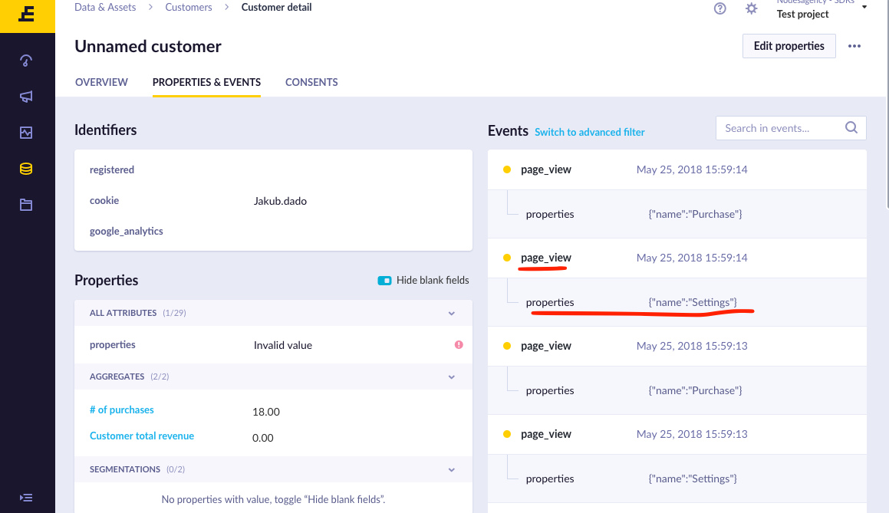

# Track Events using ExponeaSDK
You can define any event types for each of your project based on your business model or your current goals. If you have product e-commerce website, your basic customer journey will probably/most likely be:

* Visiting your App
* Searching for specific product
* Product page
* Adding product to the cart
* Going through ordering process
* Payment

So the possible events for tracking will be: ‘search’, ‘product view’, ‘add product to cart’, ‘checkout’, ‘purchase’. Remember that you can define any event names you wish. Our recommendation is to make them self-descriptive and human understandable.

By default, `ExponeaSDK` will handle some of the events automatically, this includes:
* User Session tracking
* Push Notifications
* In-app purchase

For any custom events you might come up with you can use following method

```
fun trackEvent(
        properties: PropertiesList,
        timestamp: Double? = currentTimeSeconds(),
        eventType: String?
    )
```

Example usage: Imagine a function that tracks which screen user opens. We can call it
Activity's `onCreate()` for example

1. First we have to create `PropertiesList` object. It holds a `HashMap`
with properties you want to track with this event. In our example want to track
name of the screen, so the  **screen name** could one of the properties we are sending

  `val properties = PropertiesList(hashMapOf("name" to "Settings"))`

2. Then we can pass this object to `trackEvent()` along with **eventType** (page_view) as following

  ```
  Exponea.trackEvent(
            eventType = "page_view",
            properties = properties
        )

  ```
3. You can then, go to your customers overview, and see that event was successfully tracked




# Track User Properties / User Identification

It is also possible to update the specific properties for a specific customer.

1. To better identify your users you can create `CustomerIds` object. You can specify your custom Ids by providing `HashMap<String, Any?>` or using `withId(key: String, value: Any?)` method

  `val customerIds = CustomerIds().withId("registered", "Roman")`

2. You can also pass `PropertiesList` object with any other customer related properties,
like customer name for example

  `val propertiesList = PropertiesList(hashMapOf("name" to "New Name"))`

3. Pass these params to `identifyCustomer() method`

```
  Exponea.identifyCustomer(
               customerIds = customerIds,
               properties = propertiesList
       )
```

4. You can then check identifiers and Properties in Customer overview


